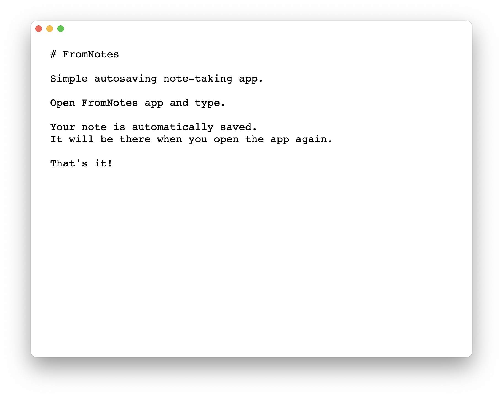

# FromNotes

Simple autosaving note-taking app for macOS.

Open **FromNotes** app and type. Your note is automatically saved. It will be
there when you open the app again. That's it!



- FromNotes is an [Electron][4] app.
- It's inspired by [FromScratch][1] and [iA / Writer][2].
- No advanced editing capabilities, except for:
  - Keeping tab indentation for the next line.
  - ⌥ Option + ⌘ Command + ⇧ Up shortcut to move line up.
  - ⌥ Option + ⌘ Command + ⇩ Down shortcut to move line down.
- The note is saved as a plain text file in `$HOME/.fromnotes`.


## Development

Install npm packages:

```sh
npm install
```

Start the application:

```sh
npm run start
```

Package and build a ready for distribution application for macOS:

```sh
npm run build
```


## Who made this?

This was made by Arturo Herrero under the MIT License. You can also find me on
Twitter [@ArturoHerrero][3].


[1]: https://fromscratch.rocks
[2]: https://ia.net/writer
[3]: https://twitter.com/ArturoHerrero
[4]: https://www.electronjs.org/
